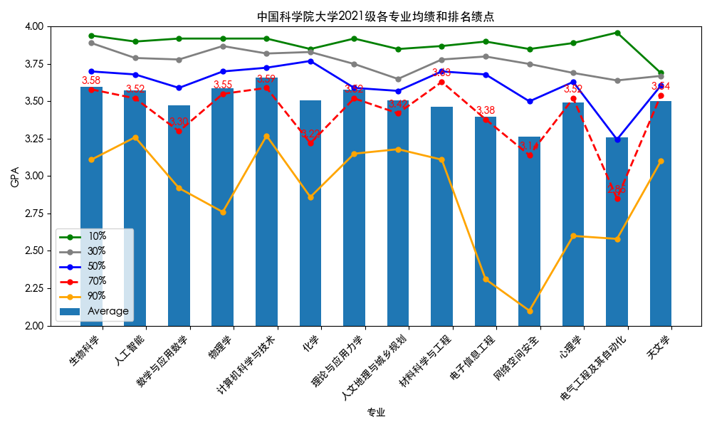
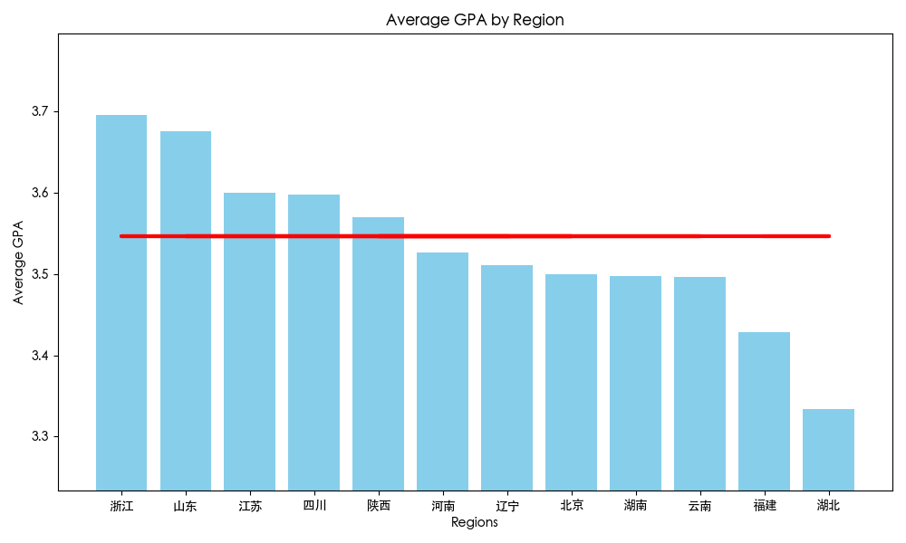
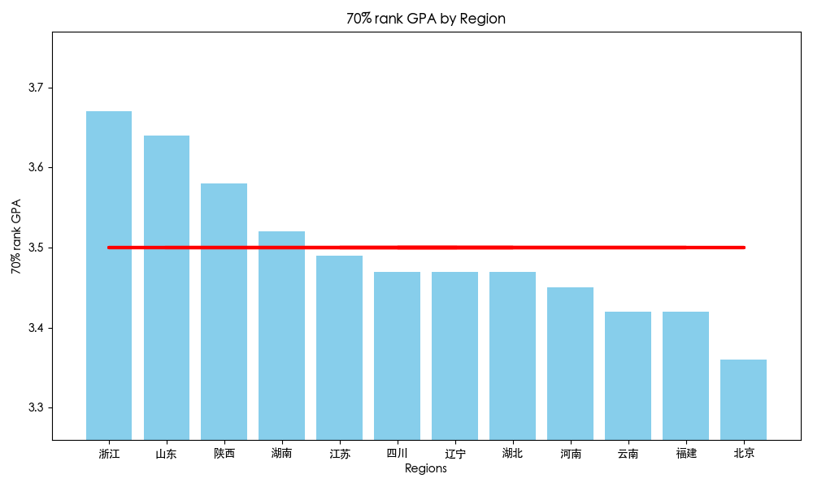

# UCAS 2021 Undergraduate Grade Analysis

## Overview

This repository hosts a web tool for analyzing the average grades of 2021 UCAS (University of Chinese Academy of Sciences) undergraduates across various courses. Users can filter courses by name and view average grades sorted from high to low.

## Features

- **Grade Sorting:** View courses with their average grades sorted from high to low.
- **Text-based Filtering:** Filter courses by entering text to find specific subjects.
- **Visualization:** Currently uses FusionCharts for data visualization, with plans to modify or replace this in the future.
- ***Clarification:*** name of course: COURSE_NAME@{units}{e/r}, where e=[elective courses], r= [required courses]

## Usage

- **Filter Courses:** Enter the course name in the search box to filter the courses.
- **View Data:** The courses will be listed along with their average grades, sorted from highest to lowest.

## Grade Analysis Image Gallery

A glimpse grade distribution(Temporarily closed source due to privacy concerns):

## Future Updates

- Potential replacement or modification of the FusionCharts component.

## Acknowledgments
- Appreciation to FusionCharts for providing the powerful charting library used in this project.
